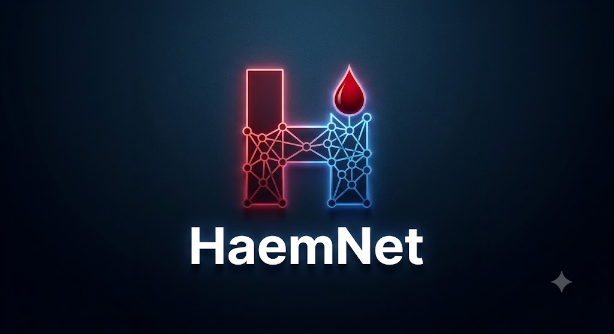
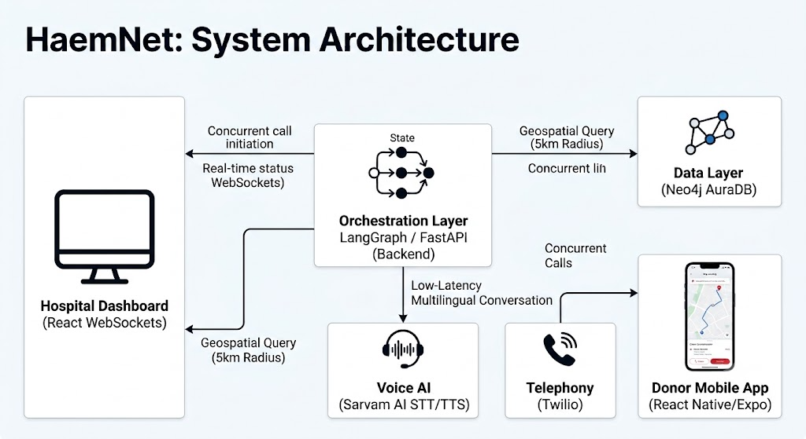

# HaemNet



An intelligent, real-time emergency blood dispatch system that leverages graph databases and AI-orchestrated voice calls to instantly connect hospitals with nearby eligible blood donors. 

## The Problem
During medical emergencies, finding matching blood donors is a race against time. The traditional process involves manually searching through disjointed donor registries, individually calling potential donors, and dealing with language barriers or uncoordinated logistics. This manual, sequential approach costs precious time, often resulting in fatal delays. 

## Our Solution
The **HaemNet** is an automated, end-to-end platform that eliminates human delays in blood procurement. When a hospital requires an urgent blood donation, our system instantly identifies the closest eligible donors, concurrently calls them using conversational AI in their native language, and routes them to the hospital upon acceptance—all while providing the hospital with a live, real-time tracking dashboard.

## Key Technologies & Innovations

### 1. Geospatial Graph Engine (Neo4j)
Finding the right donor requires complex relational and geospatial queries (e.g., finding donors with a specific blood type, within a 5km radius, who haven't donated in the last 90 days). We utilize **Neo4j**, a powerful graph database, to model donor relationships, medical history, and real-time geographic locations. This allows us to perform sub-millisecond graph traversals to instantly generate a hyper-targeted list of eligible donors for any emergency dispatch.

### 2. Conversational Voice AI (Sarvam AI)
To ensure maximum conversion rates and accessibility, our system contacts donors via phone calls rather than easily ignored text messages. We integrated **Sarvam AI**'s state-of-the-art Speech-to-Text (STT) and Text-to-Speech (TTS) models tailored specifically for Indian languages.
- **Multilingual Support:** The system automatically converses with donors in their preferred regional language (English, Hindi, Tamil).
- **Low-Latency Streaming:** By connecting Twilio audio websockets directly to Sarvam AI, we achieve near real-time, human-like conversational latency.

### 3. Cross-Platform Mobile Experience (Expo / React Native)
The donor-facing mobile application is built using **Expo and React Native**, providing a seamless native experience on both iOS and Android from a single codebase.
- **Live Routing:** When a donor accepts a request, they receive an immediate push notification with integrated map routing (`react-native-maps`) directing them to the hospital.
- **Frictionless Onboarding:** The Expo framework enables fast, reliable updates and native device capabilities (like geolocation and image picking) critical for maintaining a live donor network.

## System Architecture & Approach



Our approach relies on a heavily decoupled, event-driven architecture designed for high concurrency and real-time feedback.

- **Orchestration Layer (LangGraph):** At the core of our FastAPI backend is an autonomous state graph built with **LangGraph**. It manages the lifecycle of every outbound donor call: `INITIATE → RINGING → ANSWERED → ACCEPTED/DECLINED → ROUTE_DONOR`.
- **Concurrent Dispatch:** Instead of sequential calling, the system triggers simultaneous asynchronous voice calls to all matched donors. 
- **Real-Time Dashboard (WebSockets):** Hospital administrators use a React-based web dashboard. As the AI interacts with donors over the phone, status updates (Ringing, Answered, Accepted) are streamed live to the dashboard via WebSockets, providing complete visibility into the dispatch operation.
- **Fallback Mechanisms:** If a donor accepts a request but doesn't have the mobile app installed, the system automatically falls back to sending an SMS via Twilio with a web-based tracking link, ensuring no willing donor is lost due to technical friction.

## Technical Stack

| Component | Technology |
|-----------|------------|
| **Backend Framework** | Python, FastAPI, Uvicorn |
| **Database** | Neo4j (Graph Database), AuraDB |
| **AI Orchestration** | LangGraph, LangChain |
| **Voice AI & Telephony** | Sarvam AI (saarika:v2.5, bulbul:v3), Twilio |
| **Real-time Comms** | WebSockets (Python `websockets`) |
| **Frontend (Mobile)** | Expo, React Native, React Native Maps |
| **Frontend (Web)** | React, Expo Web / Next.js |

## Workflow Overview

1. **Trigger:** A hospital initiates an urgent dispatch request specifying the required blood group, urgency, and hospital coordinates.
2. **Query:** The backend queries Neo4j for eligible donors nearby.
3. **Call:** LangGraph orchestrates concurrent Twilio calls to all matched donors.
4. **Converse:** Sarvam AI models handle the dynamic, multi-lingual conversation, asking the donor if they are available to donate immediately.
5. **Update:** Call statuses are streamed in real-time to the hospital's web dashboard via WebSockets.
6. **Route:** Upon acceptance, the donor receives an Expo push notification (or SMS fallback) with navigation instructions to the hospital.

## Setup and Installation

### Prerequisites
- Python 3.9+
- Node.js 18+
- Neo4j AuraDB instance
- Twilio Account
- Sarvam AI API Key

### Backend Setup
```bash
cd backend
python -m venv venv
source venv/bin/activate
pip install -r requirements.txt
# Configure .env with your Neo4j, Twilio, and Sarvam AI keys
uvicorn main:app --reload
```

### Mobile App Setup
```bash
cd frontend/donor-mobile
npm install
npx expo start
```

### Web Dashboard Setup
```bash
cd frontend/donor-web
npm install
npx expo start --web
```
